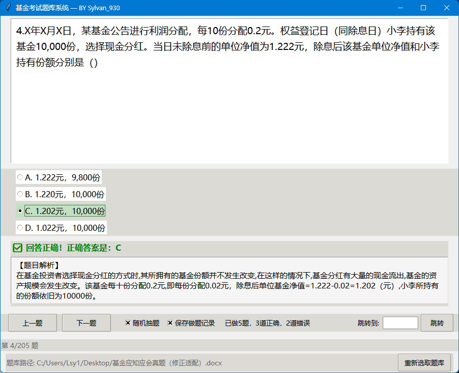

# 基金考试题库系统

## 项目介绍
这是一个简单而实用的选择题题库测试系统，专为**基金从业资格考试、银行内部资格认证**等考试设计。项目的初衷是帮助金融从业人员高效应对各类资格考试和知识测评，现在也可用于其他类型满足格式要求的选择题题库。

### 为什么需要这个系统？
当面对银行或金融机构的各类考试时，我们通常会遇到这些问题：
- 题库资料分散在各种文件格式中（Word、TXT等）
- 考前需要反复练习，但缺乏随机抽题和统计功能
- 机构内部考试系统功能单一，不支持自定义题库导入
- 考前突击需要高效记忆答案和解析

本系统解决了这些问题，支持多种文件格式的题库导入，可以进行随机抽题、答案记录和成绩统计，让考试准备更加高效和针对性。



## 软件架构
本项目采用MVC（Model-View-Controller）架构模式设计：
- **Model**：处理数据和业务逻辑
  - `models/question.py`：题目模型
  - `models/question_bank.py`：题库管理模型
- **View**：用户界面相关
  - `views/app_view.py`：主应用视图
  - `views/components/`：UI组件（题目、反馈、导航等）
- **Controller**：控制程序流程
  - `controllers/app_controller.py`：主控制器
- **Services**：提供特定功能服务
  - `services/file_service.py`：文件操作服务
  - `services/parser_service.py`：文件解析服务
- **Utils**：工具类
  - `utils/logger.py`：日志工具
  - `utils/text_utils.py`：文本处理工具

## 安装教程

1. 克隆或下载本仓库到本地
```
git clone [仓库地址] [项目路径]
```

2. 使用uv（或pip）安装依赖
```
cd [项目路径]
uv init .
uv add python-docx
```
或使用pip
```
pip install python-docx
```

**依赖说明**：
- `python-docx`：用于解析Word文档格式的题库文件
- `lxml`：作为python-docx的依赖项会自动安装，用于XML解析
- `Pillow`：如果题库中包含图片则需要此库，会作为依赖自动安装

3. 直接运行
```
python main.py
```

4. 打包为可执行文件

安装PyInstaller并使用以下命令打包：
```
pip install pyinstaller

# 基本打包命令
pyinstaller --onefile --windowed --name="基金考试题库系统" main.py

# 推荐自定义命令
pyinstaller --onefile --windowed --name="基金考试题库系统" --icon=./icon.ico --clean --hidden-import=docx --distpath="<自定义路径>" main.py
```

### 主要打包参数
- `--onefile`：打包成单个可执行文件（推荐）
- `--windowed`：以窗口模式运行，不显示控制台
- `--name`：指定输出文件名称
- `--distpath`：自定义输出目录，如桌面或其他指定位置
- `--icon`：指定程序图标（.ico或.icns格式）

### 打包提示
- 单文件模式（`--onefile`）更适合本程序，使分发和使用更方便
- 默认输出在项目的dist目录，使用`--distpath`可指定其他位置
- 通常只需指定`--hidden-import=docx`（Word文档解析库）
- 其他依赖（如lxml和Pillow）会作为间接依赖自动处理
- 如运行时提示模块缺失，再添加相应的`--hidden-import`参数
- 打包后可直接分发可执行文件或与说明文档一起打包为zip文件

更多详细选项请参考PyInstaller官方文档。

## 功能特点

- **文件选择**：使用系统文件选择器直接选择任意题库文件
- **多格式支持**：支持解析 `.docx`、`.txt` 和 `.csv` 等多种格式的题库文件
- **智能解析**：自动识别题目、选项和答案
- **随机抽题**：支持顺序或随机模式答题
- **答题记录**：可选择是否保存答题记录
- **成绩统计**：提供已答题数、正确率等实时统计
- **题目跳转**：支持直接跳转到指定题号

## 使用说明

1. 启动程序后，系统会弹出文件选择对话框，选择您的题库文件
2. 题库加载成功后，显示第一道题目，开始答题
3. 点击选项选择答案，系统会即时给出正确答案和解析
4. 使用"上一题"、"下一题"按钮或跳转功能浏览题目
5. 可选择"随机抽题"和"保存做题记录"等设置
6. 使用右下角"重新选取题库"按钮可随时切换不同的题库文件

## 题库文件格式要求

系统支持以下格式的题库文件：
- Word文档(.docx)
- 文本文件(.txt)
- CSV文件(.csv)
- 其他文本格式文件

题库文件内容需满足一定的格式要求，例如：
```
1. 这是一道单选题？
A. 选项A
B. 选项B
C. 选项C
D. 选项D
答案：A
解析：这是解析内容

2. 这是第二道题...
```

## 许可证

请查看项目中的LICENSE文件
